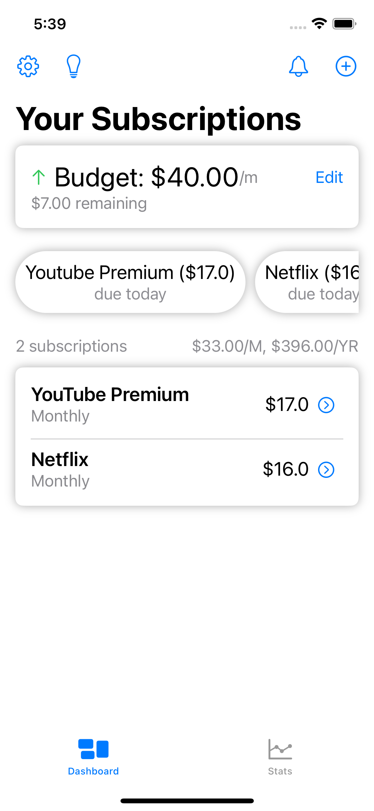

# TrackYourSubs 
### 👀 At a glance...
An IOS app to track you subscriptions and expenses, all the while presenting in a clean and professional look with a load of features. Some of the more evident features are:
* Budgeting (monthly / yearly option available)
* Current monthly & yearly total expense at a glance
* Custom suggestions to meet budget
* Organize (Categorization & Importance) and filter through subscriptions
* Reminders via scheduled notifications
* Stats page: pie chart visual, line chart visual, and streak indicator

### 🌁 Quick View

### 🧾 Where can I get this?
At the moment, the app is not available in the app store. But with further improvement and support it might some day. 🤞